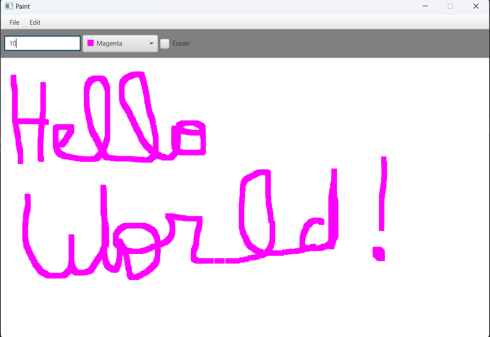

# Paint_fx
A paint app in Javafx where you can use a brush tool and draw whatever you like and whatever color you want ,  with ability to of erasing  what you did 

## technologies 

- Programming language : Java 19.0.2 
- Framework : Javafx , Scene Builder 
- Build tool : Apache Maven 3.9.4
- IDE : Intellij

## upcoming features 

- [ ] Saving feature (snapshot) 
- [ ] the ability to draw shapes (rectangle , circle )

## Pictures 

